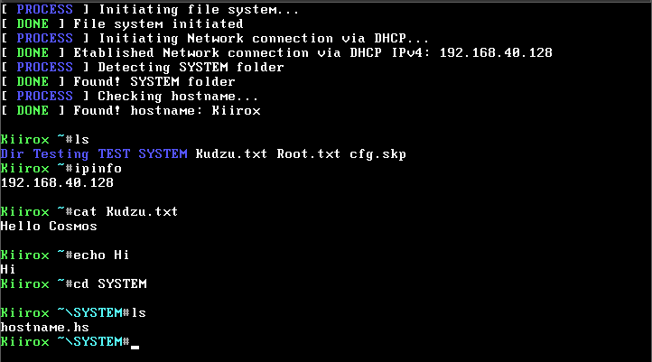
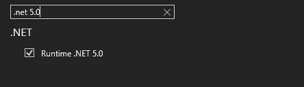
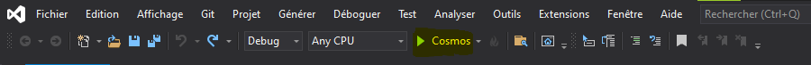

<h1 align="center">Welcome to Moxie 👋</h1>

  
  
  
  

> An OS made in C# with [Cosmos](https://github.com/CosmosOS/Cosmos)

### 🏠 [Homepage](https://github.com/Kiirx/Moxie#readme)

## Install

Download most recent release ISO or build it yourself

## Build
You must have Visual Studio 2019 with .NET 5.0 runtime support, .NET SDK and Runtime 5.0 installed.

###### (be sure that Runtime .NET 5.0 is checked)

Download .NET SDK 5.0 [Here](https://dotnet.microsoft.com/en-us/download/dotnet/thank-you/sdk-5.0.406-windows-x64-installer) (Only 64-Bit Windows is supported by Cosmos at the moment)

Download .NET Runtime 5.0 [Here](https://dotnet.microsoft.com/en-us/download/dotnet/thank-you/runtime-desktop-5.0.15-windows-x64-installer)

You also have to install Cosmos last DevKit (By cloning the project).
Run `VS2019-INSTALL.bat`, make sure to click in the following dialog window to install the missing depedencies,
wait for the installation to finish, click yes again to install inno setup and then it will install the just built Cosmos! (by default its installed on `C:\Users\username\AppData\Roaming\Cosmos User Kit`).

Open Visual Studio 2019 and select `Open a project or a solution` and select the Moxie.sln from the Moxie_OS folder and then click the build icon on the top and the ISO should be generated in `Moxie_OS\bin\Debug\net5.0\Moxie.iso`!

## Author

👤 **Kiirox**

* Twitter: [@Kiiroxtv](https://twitter.com/Kiiroxtv)
* Github: [@Kiirx](https://github.com/Kiirx)

## 🤝 Contributing

Contributions, issues and feature requests are welcome! Feel free to check [issues page](https://github.com/Kiirx/Moxie/issues). You can also take a look at the [contributing guide](https://github.com/Kiirx/Moxie/blob/main/CONTRIBUTING.md).

## Show your support

Give a ⭐️ if this project helped you!

## 📝 License

Copyright © 2022 [Kiirox](https://github.com/Kiirx). 
This project is [MIT](https://github.com/Kiirx/ProjectOrizonOS/blob/main/LICENSE) licensed.
